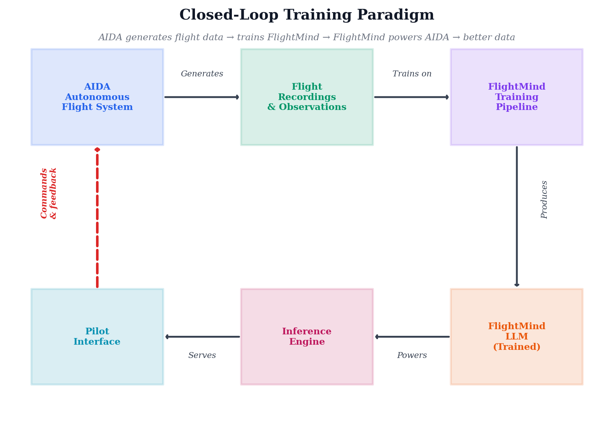
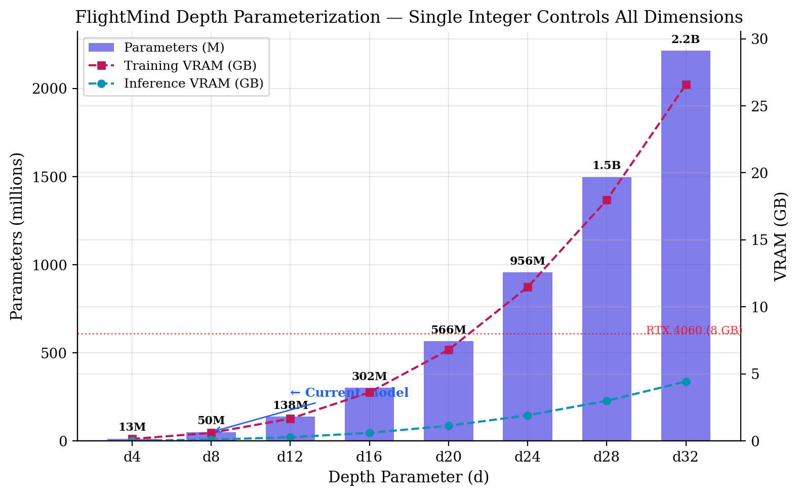
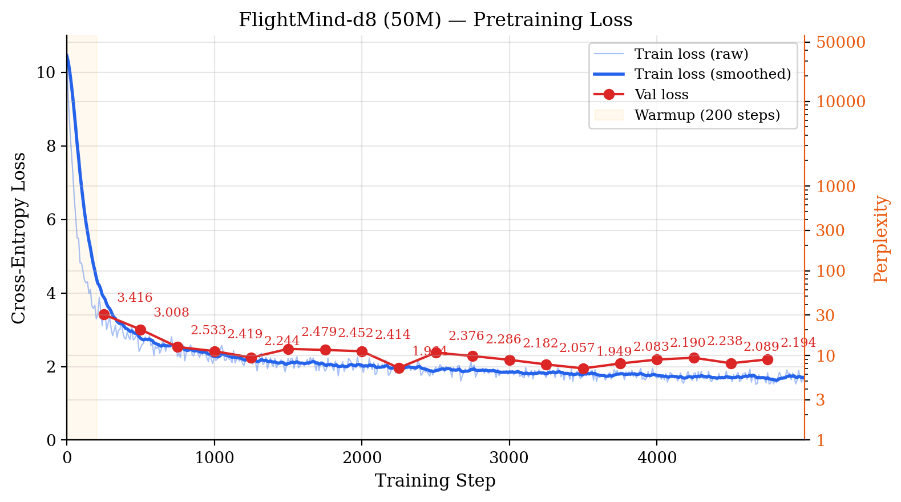

# FlightMind

**An aviation-native language model trained on data generated by the system it powers.**

FlightMind is a transformer LLM built from scratch to serve as the language reasoning engine for [AIDA](https://github.com/kushkoirala/AIDA) (Autonomous Intelligent Decision Architecture) -- an autonomous flight system that flies cross-country missions in a Cessna 172 with natural language pilot interaction.

What makes FlightMind novel is its **closed-loop training paradigm**: the autonomous system generates the data that trains the language model that powers the autonomous system. Each iteration produces higher-quality flights, which produce higher-quality training data, which produces a better model.

<p align="center">
  
</p>

## Why Not Just Fine-Tune Llama?

We could. But building from scratch gives us:

1. **Full control over architecture** -- optimized for the specific task (command parsing, not general chat)
2. **Size efficiency** -- a 1-2B aviation-specialist model outperforms an 8B generalist for structured flight commands
3. **Inference speed** -- 3-5x faster than Llama 8B on the same hardware, critical for real-time flight control
4. **Educational value** -- every layer, every design choice is documented and understood
5. **No license restrictions** -- fully owned, no Meta/commercial license concerns

The model architecture is inspired by Andrej Karpathy's [nanochat](https://github.com/karpathy/nanochat) approach: a depth-parameterized transformer where a single integer controls the entire model size.

## Project Status

**Phase: LoRA instruction fine-tuning in progress**

| Milestone | Status | Details |
|-----------|--------|---------|
| Data collection | Done | 192M+ aviation tokens from 12+ sources |
| Data cleaning pipeline | Done | 157K docs cleaned and validated |
| Custom BPE tokenizer | Done | 32K vocab trained on aviation + general text |
| Model architecture | Done | Transformer with RoPE, SwiGLU, RMSNorm, Flash Attention |
| Training infrastructure | Done | AdamW, cosine LR, grad accumulation, DDP, mixed precision |
| Evaluation suite | Done | Perplexity, sample generation, domain probing |
| d8 pretraining (50M) | Done | Perplexity 8.12, 71 tok/s generation on RTX 4060 |
| AIDA fine-tuning data pipeline | Done | 303K instruction pairs from real flights |
| d24 cloud pretraining (956M) | Done | 4x H100 SXM on Vast.ai, best val_loss 1.827 at step 4,000 |
| **Instruction fine-tuning (LoRA)** | **In Progress** | **Rank-16 LoRA on RTX 4060, 13.6M trainable params** |
| **Synthetic flight data generation** | **In Progress** | **50,000 AIDA flights across 3 machines, ~250M tokens, 5 narrative styles** |
| d32 cloud pretraining (2.2B) | Planned | 4-8x H100 SXM, ~$1,240 est. |
| AIDA integration | Planned | Drop-in replacement for Llama 8B |

## The Closed-Loop Data Pipeline

<p align="center">
  
</p>

### Phase 1: Aviation Corpus (Pretraining)

General aviation knowledge from public sources -- the model learns to "speak aviation."

| Source | Documents | Tokens | Content |
|--------|-----------|--------|---------|
| NTSB accident reports | 92,000+ | 135M | Investigation narratives, probable cause |
| METAR weather observations | 22,000+ | 33M | Real weather data from US airports |
| Wikipedia aviation articles | 9,600+ | 19.5M | Aircraft, airports, aviation concepts |
| HuggingFace aviation dataset | 15,000+ | 15M | Curated aviation text |
| Aviation StackExchange | 2,500 | 2.6M | Expert Q&A on regulations, procedures, aerodynamics |
| 14 CFR regulations | 900+ | 2.6M | Federal aviation regulations |
| FAA handbooks | 10 | 2.7M | PHAK, AFH, IFH, weight & balance |
| FAA Advisory Circulars | 10 | 675K | Icing, weather, stall/spin, non-towered ops, SMS |
| ATC transcripts | 39,000+ | 590K | Real radio communications (ATCO2, ATCSim, UWB-ATCC) |
| OpenAP aircraft performance | 7,400+ | 3M | Aircraft specs, performance models |
| SKYbrary | 4,600+ | ~4M | Safety articles, accident case studies (EUROCONTROL) |
| NASA Technical Reports | 294 | 78K | Research abstracts: aerodynamics, safety, ATC |
| **Total** | **~195,000** | **~219M** | |

### Phase 2: AIDA Flight Data (Fine-tuning)

Training data generated directly from AIDA's autonomous flights -- the model learns AIDA's specific command language.

| Source | Examples | Content |
|--------|----------|---------|
| AIDA intent observations | 244,228 | Real command/action pairs from 148K sim observations |
| Synthetic command variations | 55,000 | 9 categories: heading, altitude, speed, landing, weather, emergency |
| XC flight telemetry | 3,945 | Status narration + phase transitions from 40 recorded flights |
| **Total** | **303,173** | **~106 MB** |

Each fine-tuning example is an instruction-response pair:

```
<|system|>You are FlightMind, an aviation AI copilot for AIDA.<|end|>
<|user|>PHASE: cruise | ALT: 4500ft | SPD: 110kt | HDG: 270
turn to heading three six zero<|end|>
<|assistant|>{"action": "heading", "value": 360}
Roger, turning to heading 360.<|end|>
```

The model learns both **structured output** (JSON for the flight controller) and **pilot-style acknowledgement** (natural language for the human) in a single inference.

### Phase 3: Deploy Back to AIDA

The trained FlightMind model replaces Llama 8B as AIDA's language engine:

```
Before: Pilot command  -->  Llama 8B (5GB, ~0.5s)  -->  Flight controller
After:  Pilot command  -->  FlightMind (1-4GB, ~0.1s)  -->  Flight controller
```

Same WebSocket interface (port 8766), same FlightCommand output format, faster inference, aviation-native understanding.

## Architecture

### Depth Parameterization

The entire model is controlled by a single integer, `depth`, from which all architectural dimensions are derived. This enables seamless scaling from a 13M-parameter smoke test to a 2.2B-parameter production model by changing one number.

<p align="center">
  
</p>

| Component | Choice | Why |
|-----------|--------|-----|
| Normalization | RMSNorm (pre-norm) | Faster than LayerNorm, stable training |
| Positional encoding | RoPE | Extrapolates to longer sequences, no learned params |
| Activation | SwiGLU | Better quality than GELU/ReLU, standard for modern LLMs |
| Attention | Flash Attention | 2-4x faster, memory efficient |
| Weight tying | Embedding = LM head | Saves parameters, acts as regularizer |
| Optimizer | AdamW (beta2=0.95) | Standard for LLM pretraining |
| LR schedule | Linear warmup + cosine decay | Prevents early instability, smooth convergence |
| Precision | bfloat16 mixed precision | 2x throughput on GPU |

See [ARCHITECTURE.md](model/ARCHITECTURE.md) and [TRAINING.md](train/TRAINING.md) for detailed educational documentation on every design decision.

### Training Pipeline

```
Aviation corpus (219M tokens, 12+ sources)  +  FineWeb-EDU (~1.3T tokens, streamed)
  --> BPE tokenize (32K vocab)
  --> Pack into 2048-token sequences (50% aviation / 50% general)
  --> Multi-GPU DDP pretrain on 4x H100 (AdamW, cosine LR, bfloat16)
  --> Best checkpoint at step 4,000 (val_loss 1.827)

AIDA flight data (303K instruction pairs)
  --> LoRA instruction fine-tuning (rank 16, RTX 4060)  <-- IN PROGRESS
  --> Evaluate on command parsing accuracy
  --> Deploy to AIDA

AIDA flight simulator (50,000 headless flights, 3 machines)
  --> 5 narrative styles per flight  <-- IN PROGRESS
  --> ~250M new tokens of physics-grounded aviation text
  --> Re-tokenize and integrate into pretraining corpus
```

### Inference on AIDA Hardware

FlightMind is designed to run inference on the same RTX 4060 that powers AIDA's flight simulation:

| Model | Params | Inference VRAM | Tokens/sec | Capability |
|-------|--------|---------------|------------|------------|
| d20 | 566M | ~1.5 GB | ~200+ | Structured commands |
| d24 | 956M | ~2.5 GB | ~120+ | + reasoning |
| d32 | 2.2B | ~5.5 GB | ~60+ | + complex queries |
| Llama 8B (current) | 8B | ~5 GB (Q4) | ~30 | Overkill for task |

## Training Results

### d8 (50M params) -- Complete

Trained on RTX 4060 with 109M aviation tokens. 5,000 steps, 10.3 hours, 1.31B tokens processed.

<p align="center">
  
</p>

| Step | Train Loss | Val Loss | Perplexity | Notes |
|------|-----------|----------|------------|-------|
| 0 | 10.45 | -- | 34,600 | Random initialization |
| 250 | 3.53 | 3.42 | 30.4 | Learning basic patterns |
| 500 | 2.51 | 3.01 | 20.2 | Coherent text emerging |
| 1,000 | 2.08 | 2.42 | 11.2 | Beating GPT-2 (124M) on domain text |
| 2,000 | 1.88 | 2.07 | 7.9 | Strong aviation vocabulary |
| **3,500** | **1.75** | **1.95** | **7.0** | **Best checkpoint (early stopping)** |
| 5,000 | 1.60 | 2.19 | 8.9 | Overfitting (val loss rising) |

**Final evaluation on best checkpoint (step 3,500):**
- **Perplexity: 8.12** (100-batch evaluation, 1.08M tokens)
- **Generation speed: 71.4 tok/s** on RTX 4060
- Loss range across batches: [1.07, 2.81] -- low on structured data (METARs), higher on narrative (NTSB reports)

For reference, GPT-2 (124M params) achieves perplexity ~29 on general web text. Our 50M model achieves **8.12** on aviation text -- less than half the parameters, a quarter the perplexity. Domain specialization works.

<p align="center">
  
</p>

### d24 (956M params) -- Pretraining Complete, Fine-tuning In Progress

Scaling to production size on Vast.ai cloud GPUs. The d24 model is 19x larger than d8, requiring multi-GPU training with DistributedDataParallel (DDP) across NVLink-connected H100s.

**Why d24?** At 956M parameters, FlightMind-d24 sits in the sweet spot between capability and inference cost. It's large enough for reasoning-level tasks (command disambiguation, multi-step flight planning) while staying under 2.5 GB VRAM for inference -- comfortably within the RTX 4060's budget alongside AIDA's other GPU workloads.

#### Cloud Training Specifications

| Parameter | Value | Rationale |
|-----------|-------|-----------|
| **Hardware** | 4x NVIDIA H100 80GB SXM (NVLink) | NVLink gives ~900 GB/s GPU-to-GPU bandwidth for fast gradient sync |
| **Provider** | Vast.ai (on-demand) | Best $/GPU-hr for short-term training; no long-term commitment |
| **Instance cost** | $6.40/hr ($1.60/GPU/hr) | Competitive on-demand H100 pricing |
| **Parallelism** | DDP (data parallel, 4-way) | Model fits on one GPU (15 GB); DDP gives near-linear throughput scaling |
| **Precision** | bfloat16 mixed precision | 2x throughput on H100, no loss scaling needed |
| **Effective batch** | 524K tokens/step | 8 micro-batches x 8 grad accum steps x 4 GPUs x 2047 tokens |
| **Learning rate** | 6e-4 peak, cosine decay to 6e-5 | Standard for ~1B models; 500-step linear warmup |
| **Total steps** | 95,000 | ~50B token-presentations (Chinchilla-optimal for 956M params) |
| **Data mix** | 50% aviation / 50% FineWeb-EDU (final config) | Started at 70/30, pivoted to 50/50 after analysis |
| **Throughput** | ~175K tok/s | ~3.0 sec/step across 4 GPUs |
| **Wall-clock time** | ~79 hours (~3.3 days) | Including FineWeb stream init (~15s) |
| **Estimated cost** | ~$506 | 79h x $6.40/hr |

#### Data Strategy: Streaming FineWeb-EDU

With only 108M tokens stored locally (aviation corpus), training for 95K steps at 524K tokens/step would repeat the data ~460 times -- far too much repetition. Instead, we stream the general-domain portion (70% of each batch) directly from HuggingFace's FineWeb-EDU dataset (~1.3T tokens of high-quality educational web text).

Each micro-batch is split: **4 sequences from local aviation data + 4 sequences from FineWeb-EDU** = 8 total (50/50 split; originally 2+6 before the ratio pivot). The streamer tokenizes and packs documents on-the-fly with the same BPE tokenizer used for the aviation corpus. In DDP mode, each GPU gets a different shard of the stream so no data is duplicated.

#### Multi-GPU Setup: What We Learned

- **NCCL NVLS incompatibility**: Vast.ai Docker containers don't support NCCL's NVLink Sharp (NVLS) multicast feature. DDP hangs silently at `DDP(model, device_ids=[...])` during model initialization. Fix: `NCCL_NVLS_ENABLE=0`. NVLink P2P still works -- only the NVLS optimization is disabled, with no measurable performance impact for sub-2B models.
- **Gradient accumulation with `no_sync()`**: During the 8 micro-steps of gradient accumulation, only the final micro-step triggers the NCCL all-reduce. This reduces inter-GPU communication by 8x.
- **Rank-aware I/O**: Only GPU rank 0 logs, evaluates, and saves checkpoints. Other ranks wait at `dist.barrier()` synchronization points.

#### Early Training Progress

| Step | Train Loss | Throughput | Notes |
|------|-----------|------------|-------|
| 0 | 10.69 | 164K tok/s | Random initialization |
| 10 | 8.61 | 172K tok/s | Rapid initial learning |
| 20 | 8.06 | 175K tok/s | Throughput stabilizing |
| 30 | 7.81 | 175K tok/s | Steady convergence |
| 40 | 7.14 | 175K tok/s | Still in LR warmup |
| 50 | 6.80 | 175K tok/s | Loss dropping well |

#### Data Mix Pivot: 70/30 to 50/50

The initial training plan used a **70% FineWeb-EDU / 30% aviation** data mix. However, analysis of early checkpoints revealed the model was developing strong general language skills but underperforming on domain-specific aviation knowledge. We pivoted to a **50/50** split to strengthen aviation specialization:

```
Before: 2 aviation + 6 FineWeb = 8 sequences/micro-batch (30% aviation)
After:  4 aviation + 4 FineWeb = 8 sequences/micro-batch (50% aviation)
```

Training resumed from the best checkpoint at step 3,501 with the new ratio.

#### Overfitting and Early Stopping

By step ~9,800, validation loss was steadily diverging from training loss -- a textbook sign of overfitting:

| Eval Step | Val Loss | Delta from Best |
|-----------|----------|-----------------|
| 4,000 | **1.827** | -- (best) |
| 4,500 | 1.831 | +0.004 |
| 5,000 | 1.944 | +0.117 |
| 5,500 | 1.993 | +0.166 |
| 6,000 | 2.143 | +0.316 |
| 6,500 | 2.199 | +0.372 |
| 7,000 | 2.332 | +0.505 |
| 7,500 | 2.509 | +0.682 |
| 8,000 | 2.460 | +0.633 |
| 8,500 | 2.657 | +0.830 |
| 9,000 | 2.667 | +0.840 |
| 9,500 | **2.974** | **+1.147** |

**Root cause:** The 108M-token aviation corpus was being repeated ~29 times by step 9,800. The model memorized the training set while generalizing poorly. The best checkpoint was saved at **step 4,000 (val_loss 1.827)** -- everything after was wasted compute.

**Lesson learned:** For a domain corpus this small relative to model capacity, more training steps just means more memorization. The data is the bottleneck, not the compute. This directly motivated the synthetic data generation effort (see below).

The Vast.ai instance (4x H100 SXM) was stopped after training completed. The best checkpoint (10.69 GB) was downloaded to local storage for fine-tuning.

#### Actual Cloud Training Cost

| Item | Hours | Rate | Cost |
|------|-------|------|------|
| 4x H100 SXM (Vast.ai) | ~30 | $6.54/hr | ~$200 |

The instance was active for about a day total, covering both the initial 70/30 run (steps 0-3,500) and the 50/50 continuation (steps 3,501-9,900).

### d24 LoRA Instruction Fine-tuning -- In Progress

With the pretrained d24 checkpoint (val_loss 1.827), we moved to instruction fine-tuning using LoRA (Low-Rank Adaptation) on the local RTX 4060. LoRA freezes the base model weights and trains small rank-decomposition matrices inserted into each linear layer -- drastically reducing memory and compute requirements.

#### LoRA Configuration

| Parameter | Value | Rationale |
|-----------|-------|-----------|
| **Base model** | d24 best.pt (956M params) | Best pretrained checkpoint (step 4,000) |
| **LoRA rank** | 16 | Good balance of expressiveness vs efficiency |
| **LoRA alpha** | 32 | Alpha/rank = 2 scaling factor |
| **Target layers** | All linear layers (168 total) | q_proj, k_proj, v_proj, o_proj, gate_proj, up_proj, down_proj x 24 layers |
| **Trainable params** | 13,565,952 (1.42% of total) | 70x fewer params than full fine-tuning |
| **Optimizer memory** | ~163 MB | vs 11.5 GB for full fine-tuning |
| **Hardware** | RTX 4060 (8 GB VRAM) | 7.8 GB used, fits in consumer GPU |
| **Batch size** | 2 (effective 4 with grad_accum=2) | VRAM-limited |
| **Learning rate** | 2e-4, cosine decay to 2e-5 | 100-step warmup |
| **Max steps** | 2,000 | ~20 hours on RTX 4060 |
| **Resume support** | `--resume <checkpoint>` | Restores LoRA weights + optimizer state from any saved step |
| **Sequence length** | 512 tokens | Instruction pairs are short |
| **Loss masking** | Assistant tokens only | Only learn to generate responses, not repeat prompts |

#### Instruction Data

The fine-tuning dataset uses a chat template format with system, user, and assistant roles:

| Source | Examples | Content |
|--------|----------|---------|
| AIDA intent observations | 244,228 | Real command/action pairs from flight sim |
| Synthetic command variations | 55,000 | Heading, altitude, speed, landing, weather, emergency |
| XC flight telemetry | 3,945 | Status narration + phase transitions |
| **Total** | **303,173** | |

#### Fine-tuning Progress

| Step | Loss | LR | Grad Norm | Throughput |
|------|------|----|-----------|------------|
| 0 | 4.475 | 2.0e-6 | 7.85 | 49 tok/s |
| 10 | 3.813 | 2.2e-5 | 6.78 | 55 tok/s |
| 20 | 2.043 | 4.2e-5 | 4.90 | 55 tok/s |
| 50 | 1.624 | 1.0e-4 | 3.64 | 56 tok/s |
| 100 | 0.217 | 2.0e-4 | 1.27 | 57 tok/s |
| 150 | 0.278 | 2.0e-4 | 1.44 | 57 tok/s |
| 200 | 0.128 | 1.99e-4 | 0.61 | 57 tok/s |
| 220 | 0.061 | 1.98e-4 | 0.57 | 57 tok/s |
| 230 | 0.196 | 1.98e-4 | 0.79 | 57 tok/s |

Loss dropped from 4.47 to ~0.1 in 230 steps -- the model has learned the instruction format and is converging. Grad norm has stabilized below 1.0, indicating stable optimization. Training continues with ~1,770 steps remaining (~16 hours).

### Synthetic Aviation Data Generation -- In Progress

The overfitting analysis pointed to limited data diversity as a contributing factor. The current corpus is ~70% NTSB accident reports, which skews the model's language toward investigation narratives. To introduce more variety -- particularly normal flight operations -- we're generating a synthetic corpus using AIDA's flight simulator.

#### Approach

50,000 headless flights are simulated across 11 Kansas airports (90 possible origin/destination pairs) using AIDA's CPU-only 6-DOF physics engine (RK4 integration at 50 Hz) and `GeneralizedXCController`. Each flight uses randomized parameters:

- **Cruise altitude**: 3,000-8,000 ft in 500 ft increments
- **Wind**: Random heading (0-360) + speed (0-25 kts)
- **Deviations**: 15% of flights include altitude changes, heading deviations, or go-arounds
- **Weather**: VFR clear, marginal VFR, scattered clouds, overcast

Each completed flight is then converted into **5 narrative styles**:

| Style | Description | Tokens/flight |
|-------|-------------|---------------|
| **Flight Report** | NTSB-style narrative for normal operations | ~1,500 |
| **Instructional** | Textbook cross-country planning prose | ~1,200 |
| **Pilot Log** | First-person pilot notes and entries | ~800 |
| **ATC Communications** | Simulated radio exchange transcripts | ~500 |
| **Technical Parameter Log** | Timestamped telemetry data | ~1,000 |

**Key advantage:** The text is **physics-grounded** -- altitudes, airspeeds, headings, and distances come from actual simulated flight dynamics, not hallucinated by a language model. Every number in the generated text corresponds to a real computed value.

#### Portable Flight Generator

The flight simulation code was extracted into a **self-contained portable package** (`flightgen-portable/`) that runs on any machine with Python 3.9+ and NumPy -- no GPU, no CUDA, no special dependencies. This enables distributed generation across heterogeneous hardware.

See [`flightgen-portable/README.md`](flightgen-portable/README.md) for package documentation.

#### Distributed Generation

Flight generation runs across 3 machines in parallel using `--machine-id` for unique seed ranges so output files never collide:

| Machine | ID | CPU | Workers | Flights | Status |
|---------|------|-----|---------|---------|--------|
| Dell 7920 | 0 | 2x Xeon Gold 5118 (48 threads) | 38 | 20,000 | In Progress |
| ROG Ally X | 2 | AMD Ryzen Z2 Extreme (16 threads) | 14 | 15,000 | In Progress |
| Mac M3 Pro | 1 | Apple M3 Pro (12 cores) | 8 | 15,000 | Planned |

Narratives are written to disk **incrementally** as each flight completes, preventing data loss from long-running jobs (~36 hours per machine). Total target: **50,000 flights producing ~250M estimated tokens** -- more than doubling the existing corpus.

#### Generation Progress

| Machine | Flights | Rate | Landing % | ETA |
|---------|---------|------|-----------|-----|
| Dell 7920 (38 workers) | ~500 / 20,000 | 0.2 flights/s | ~96% | ~36 hrs |
| ROG Ally X (14 workers) | ~370 / 15,000 | 0.1 flights/s | ~95% | ~38 hrs |
| Mac M3 Pro | -- | -- | -- | Not started |

The ~250M tokens will more than double the corpus from 219M to ~469M tokens, and critically shift the composition away from NTSB accident reports toward **normal flight operations, instructional text, pilot communications, and technical data**.

### Data Expansion: New Sources

To address the data scarcity problem (108M aviation tokens repeated ~29x during pretraining), we expanded the corpus with automated collection from additional public sources:

| Source | Method | Documents | Est. Tokens | Notes |
|--------|--------|-----------|-------------|-------|
| Aviation StackExchange | Stack Exchange API | 2,500 Q&As | 2.6M | Expert answers on regulations, aerodynamics, procedures |
| FAA Advisory Circulars | FAA.gov PDF download | 10 ACs | 675K | Icing (91-74B), weather (00-6B), SMS (120-92B), inspection (43.13-1B) |
| ATC Transcripts | HuggingFace datasets | 39,318 utterances | 590K | ATCO2, ATCSim, UWB-ATCC radio communications |
| SKYbrary | Sitemap crawl + HTML extraction | 4,632 articles | ~4M (est) | EUROCONTROL aviation safety knowledge base |
| NASA NTRS | NTRS search API | 294 reports | 78K | Technical report abstracts on aviation research |
| **ASRS** | **Manual download required** | **--** | **--** | **NASA safety reports: no public API, CSV export only** |

**Total new tokens: ~8M** (plus ~4M SKYbrary in progress). These complement the existing 192M-token corpus by adding **expert Q&A, regulatory guidance, real ATC phraseology, and international safety knowledge** -- content types that were previously underrepresented.

All collection scripts are in `scripts/collect/` and follow a consistent pattern: download, extract text, save manifest with token counts.

## Quick Start

```bash
# Install dependencies
pip install -r requirements.txt

# Collect and clean data
python scripts/collect/collect_all.py
python scripts/process/clean_all.py

# Build tokenizer
python tokenizer/train_tokenizer.py

# Prepare training data
python train/dataloader.py

# Train (smoke test on CPU)
python train/pretrain.py --depth 4 --device cpu --max-steps 100

# Train (single GPU)
python train/pretrain.py --depth 8 --device cuda --batch-size 4

# Train (multi-GPU with DDP)
torchrun --nproc_per_node=4 train/pretrain.py --depth 24 --batch-size 8 --fineweb

# Evaluate
python train/evaluate.py --checkpoint checkpoints/best.pt --all

# Generate AIDA fine-tuning data
python data/collectors/convert_intent_observations.py
python data/collectors/generate_synthetic_commands.py
python data/collectors/convert_xc_telemetry.py
```

## Project Structure

```
FlightMind/
|-- README.md                          # This file
|-- requirements.txt                   # Python dependencies
|-- config.yaml                        # Project configuration
|-- dashboard.py                       # Real-time monitoring dashboard (web UI)
|-- ally_status.py                     # ROG Ally status reporter (JSON via SSH)
|
|-- model/                             # Model architecture
|   |-- __init__.py
|   |-- config.py                      # Depth-parameterized config
|   |-- flightmind.py                  # Transformer implementation
|   +-- ARCHITECTURE.md                # Architecture documentation
|
|-- train/                             # Training pipeline
|   |-- pretrain.py                    # Pretraining loop
|   |-- finetune.py                    # LoRA instruction fine-tuning (--resume support)
|   |-- dataloader.py                  # Data loading + tokenization
|   |-- evaluate.py                    # Evaluation + generation
|   +-- TRAINING.md                    # Training documentation
|
|-- tokenizer/                         # Custom BPE tokenizer
|   |-- train_tokenizer.py             # Tokenizer training script
|   +-- tokenizer.json                 # Trained tokenizer (gitignored)
|
|-- flightgen-portable/                # Portable flight data generator
|   |-- generate_flights.py            # Main entry point (scenarios, sim, narration)
|   |-- flight_dynamics.py             # CPU-only 6-DOF flight simulator (NumPy)
|   |-- xc_controller.py              # Cross-country controller with triangle intercept
|   |-- requirements.txt               # Just numpy
|   +-- README.md                      # Package documentation
|
|-- data/
|   |-- raw/                           # Downloaded source data (gitignored)
|   |   +-- aida_synthetic/            # Generated flight narratives (5 styles)
|   |-- cleaned/                       # Processed text (gitignored)
|   |-- tokenized/                     # Binary token arrays (gitignored)
|   |-- finetune/                      # AIDA fine-tuning data
|   +-- collectors/                    # Data conversion scripts
|       |-- convert_intent_observations.py
|       |-- generate_synthetic_commands.py
|       +-- convert_xc_telemetry.py
|
|-- scripts/
|   |-- collect/                       # Data collection scripts
|   |   |-- collect_stackexchange.py   # Aviation StackExchange Q&A
|   |   |-- collect_skybrary.py        # SKYbrary safety articles
|   |   |-- collect_nasa_ntrs.py       # NASA Technical Reports
|   |   |-- collect_faa_acs.py         # FAA Advisory Circulars
|   |   |-- collect_faa_handbooks.py   # FAA handbooks (PHAK, AFH, etc.)
|   |   |-- collect_ntsb.py            # NTSB accident reports
|   |   |-- collect_metar.py           # METAR weather observations
|   |   +-- collect_wikipedia.py       # Wikipedia aviation articles
|   |-- process/                       # Data cleaning scripts
|   |-- launch_finetune.ps1            # Download monitor + finetune launcher
|   +-- run_finetune_v2.ps1            # Optimized LoRA fine-tuning launcher
|
|-- docs/
|   |-- cloud_requirements_d24.md      # d24 cloud training specs
|   |-- cloud_requirements_d32.md      # d32 cloud training specs
|   |-- vastai_setup_guide.md          # Vast.ai deployment guide
|   |-- generate_figures.py            # Chart/figure generation script
|   +-- figures/                       # Publication-quality figures
|
|-- checkpoints/                       # Model checkpoints (gitignored)
+-- run_train.ps1                      # PowerShell training launcher
```

## Hardware

| Role | Hardware | Notes |
|------|----------|-------|
| Data processing + d8 training | Dell 7920 (2x Xeon Gold 5118, 64GB, RTX 4060) | Primary development machine |
| d24 pretraining | 4x H100 80GB SXM (NVLink) on Vast.ai | ~1 day, ~$200 |
| d24 LoRA fine-tuning | RTX 4060 8GB (Dell 7920) | ~20 hrs, $0 |
| Flight gen (20K flights) | Dell 7920 (38 CPU workers) | CPU-only flight sim |
| Flight gen (15K flights) | ROG Ally X (AMD Ryzen Z2 Extreme, 16GB, 14 workers) | Remote via SSH/Tailscale |
| Flight gen (15K flights) | Mac M3 Pro (12-core ARM, 8 workers) | Planned |
| AIDA inference | Dell 7920 + RTX 4060 | FlightMind serves AIDA |

All machines are connected via [Tailscale](https://tailscale.com) mesh VPN for SSH access and dashboard monitoring.

## Monitoring Dashboard

A real-time monitoring dashboard (`dashboard.py`) tracks all training and data generation activities across all machines from a single page. It auto-detects the viewing device and serves a responsive layout:

- **Mobile** (< 768px): Compact cards with progress bars and loss chart -- designed for quick status checks from a phone
- **Desktop**: 2-column grid with hardware specs, prediction cards, rate history charts, cumulative flight charts, and LoRA loss tracking

The dashboard runs on the Dell 7920 and is accessible via Tailscale from any device on the mesh:

```bash
python dashboard.py
# Local:     http://localhost:8080
# Tailscale: http://<tailscale-ip>:8080
```

**Data sources:**
- Dell system metrics: `psutil` + `nvidia-smi` (CPU, GPU, RAM, temps)
- Dell flight gen: file counting in `data/raw/aida_synthetic/`
- LoRA fine-tuning: log parsing + checkpoint scanning
- ROG Ally: SSH polling via `ally_status.py` (JSON status reporter)

The dashboard collects data every 30 seconds and maintains a rolling history for trend charts and completion time predictions.

## Relationship to AIDA

FlightMind is the **language brain** of AIDA. AIDA handles:
- Classical flight control (PID autopilot, FSM phase management)
- GPU-accelerated 6-DOF physics (CUDA, 500M+ steps/sec)
- Bayesian intent inference (von Mises/Gaussian posteriors)
- Safety enforcement (Control Barrier Functions)
- Residual RL policy (PPO-trained neural corrections)

FlightMind handles:
- Natural language command parsing ("turn heading 270" -> structured action)
- Flight status narration (telemetry -> human-readable reports)
- Weather interpretation (METAR/TAF decoding)
- Aviation knowledge queries (V-speeds, procedures, regulations)
- Pilot-style communication (ATC phraseology, acknowledgements)

Together they form a complete autonomous flight system where the pilot speaks naturally and the aircraft responds with both precise control actions and clear communication.

## Documentation

This is an educational project. Every design decision is documented:

- [ARCHITECTURE.md](model/ARCHITECTURE.md) -- Model architecture decisions (RoPE, SwiGLU, RMSNorm, Flash Attention, weight tying)
- [TRAINING.md](train/TRAINING.md) -- Training pipeline (AdamW, LR schedules, gradient accumulation, DDP, mixed precision, scaling laws)
- [Cloud Requirements (d24)](docs/cloud_requirements_d24.md) -- GPU, VRAM, storage, and cost estimates for d24 training
- [Cloud Requirements (d32)](docs/cloud_requirements_d32.md) -- Same for the larger d32 model
- [Vast.ai Setup Guide](docs/vastai_setup_guide.md) -- Step-by-step cloud deployment with NCCL fixes and monitoring
- [Portable Flight Generator](flightgen-portable/README.md) -- Self-contained flight data generation package for distributed execution

## Acknowledgments

- [Andrej Karpathy](https://github.com/karpathy) -- nanochat, nanoGPT, llm.c (architecture inspiration)
- [HuggingFace](https://huggingface.co) -- tokenizers library, FineWeb-EDU, datasets
- FAA, NTSB, NASA -- public aviation data (handbooks, ACs, accident reports, NTRS)
- [SKYbrary](https://skybrary.aero) (EUROCONTROL) -- aviation safety knowledge base
- [Aviation StackExchange](https://aviation.stackexchange.com) -- community expert Q&A
- [OpenAP](https://openap.dev) (TU Delft) -- aircraft performance models

## License

MIT
