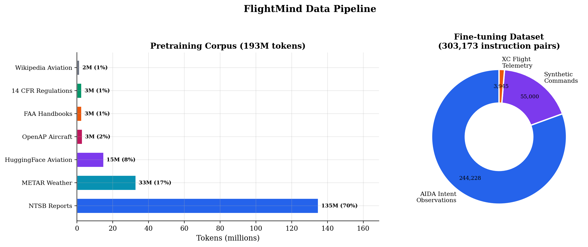
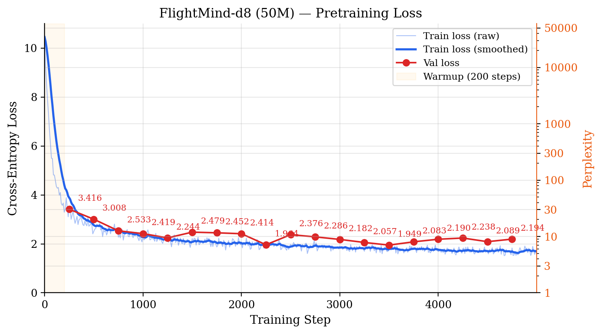
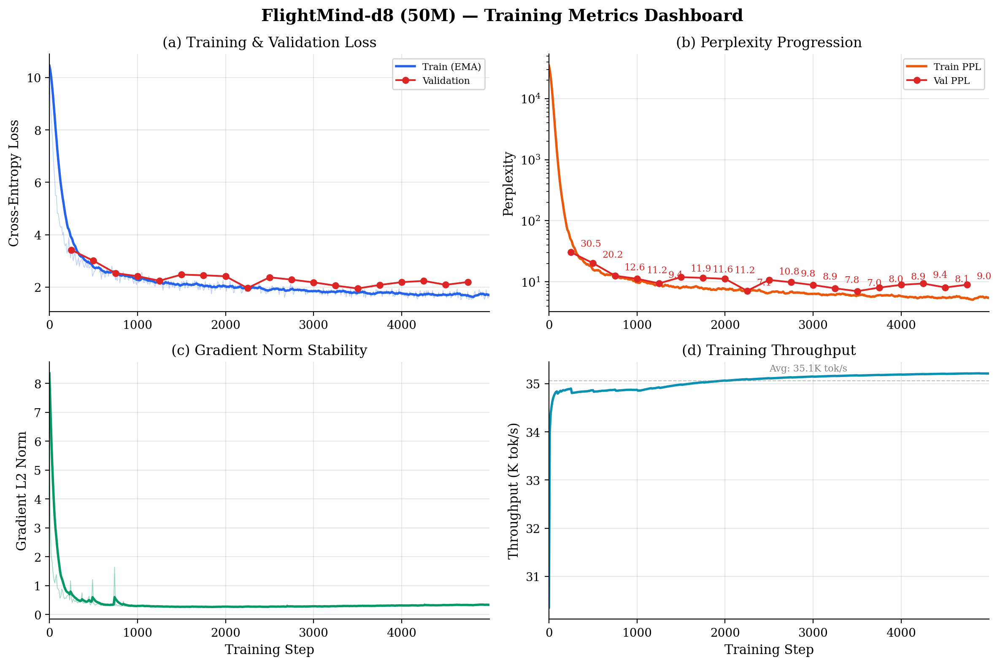
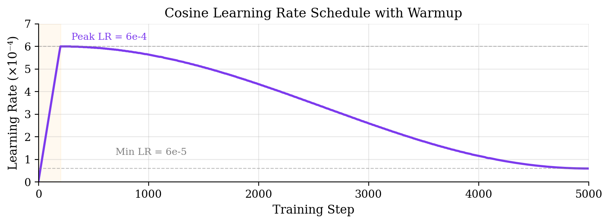
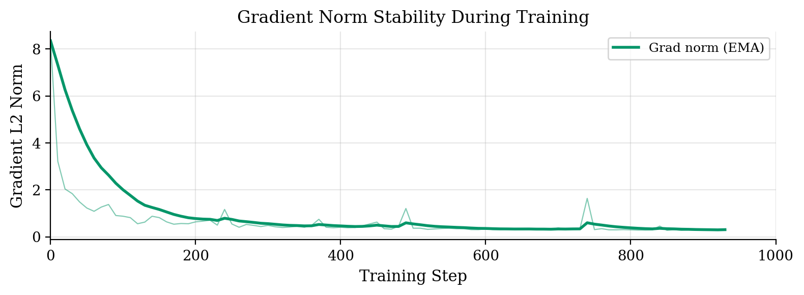

# FlightMind

A from-scratch aviation language model. This README covers what we built, why we built it, and what went wrong.

FlightMind started as an attempt to train a small transformer LLM, from scratch, for one job: the language engine of [AIDA](https://github.com/kushkoirala/AIDA), an autonomous system that flies cross-country missions in a Cessna 172. We trained two models, 50M and 956M parameters, got partway into fine-tuning, and stopped. Along the way it became clear that training a model this way was probably not how you get a good role-specialized model.

What's here is the code, the actual results, and the lessons. If you're about to train your own domain model, skip to [the lessons](#what-we-learned) first.

## Why we did this

We wanted a model specialized for a job, not a general chatbot. AIDA ran a general-purpose Llama 8B as its language engine. The bet was that a small model trained only on aviation could be cheaper to run, faster, and more reliable at aviation tasks. That bet still seems reasonable. The open question was whether building one from scratch was the right way to make it.

We went ahead for two reasons. First, it was a way to learn the whole pipeline by doing it: data collection, tokenization, pretraining, multi-GPU scaling, fine-tuning, evaluation. You pick up things doing that work that no blog post teaches you. Second, trying it was cheap. We had cheap access to H100s, so the experiment cost almost nothing. Low cost, high learning, so we ran it.

We also suspected it might be the wrong approach, and part of the point was to find out. We did.

## What we set out to build

FlightMind was going to be AIDA's "language brain." Take a spoken pilot command like "turn to heading three six zero", turn it into a structured action, `{"action":"heading","value":360}`, plus a spoken acknowledgement. Narrate flight status. Answer aviation questions.

The plan was ordinary: build a depth-parameterized decoder in the style of Karpathy's [nanochat](https://github.com/karpathy/nanochat) (RoPE, SwiGLU, RMSNorm, Flash Attention), pretrain it on an aviation corpus, then instruction-fine-tune it on flight data.

## What we actually did

- Collected ~219M tokens of aviation text from a dozen-plus public sources: NTSB reports, METARs, FAA handbooks, regulations, Wikipedia, ATC transcripts, Aviation StackExchange, and others.
- Trained a custom 32K BPE tokenizer on aviation plus general text.
- Built the model: a standard decoder where one integer, `depth`, sets the whole size.
- Trained `d8` (50M params) on a single RTX 4060.
- Trained `d24` (956M params) on 4 H100s rented from Vast.ai, about $200 of compute.
- Started LoRA instruction fine-tuning and synthetic-data generation. Both stopped early, and why they stopped is most of what we learned.

All of it is in this repo. See [what's in here](#whats-in-this-repo).

## Results

### The corpus

<p align="center">
  
</p>

| Source | Tokens | |
|--------|--------|---|
| NTSB accident reports | 135M | Investigation narratives. About 62% of the corpus. |
| METAR weather observations | 33M | |
| Wikipedia aviation articles | 19.5M | |
| HuggingFace aviation dataset | 15M | |
| FAA handbooks, regulations, ACs | ~6M | |
| OpenAP aircraft performance | 3M | |
| Aviation StackExchange | 2.6M | |
| ATC transcripts, SKYbrary, NASA NTRS, others | ~5M | |
| Total | ~219M | |

That table is itself a result. Almost two-thirds of the corpus is NTSB accident narratives, which pulled the model's voice toward investigation prose. The imbalance comes back to bite us further down.

### d8 (50M params), completed

Trained on an RTX 4060. 5,000 steps, about 10 hours.

<p align="center">
  
</p>

| Step | Train Loss | Val Loss | Perplexity | Notes |
|------|-----------|----------|------------|-------|
| 0 | 10.45 | n/a | n/a | Random init |
| 1,000 | 2.08 | 2.42 | 11.2 | Coherent text emerging |
| 2,000 | 1.88 | 2.07 | 7.9 | Strong aviation vocabulary |
| 3,500 | 1.75 | 1.95 | 7.0 | Best checkpoint (early stopping) |
| 5,000 | 1.60 | 2.19 | 8.9 | Overfitting, val loss rising |

On the best checkpoint we measured perplexity 8.12 and 71 tok/s generation on the 4060.

One caveat on that 8.12, because it's easy to misread. It means the model predicts aviation tokens well. It does not mean the model beats GPT-2, whose ~29 perplexity sits on different text with a different tokenizer, so the two numbers don't compare. And low perplexity is not the same as being good at a task. Read it as "the model learned aviation text," and stop there.

<p align="center">
  
</p>

### d24 (956M params), completed, and the result that mattered

We scaled to 956M on 4 H100s with DDP and bfloat16. The training artifacts are real:

<p align="center">
  
  
</p>

The headline is that it overfit. Best validation loss landed at step 4,000. After that, validation loss climbed while training loss kept falling:

| Eval Step | Val Loss | vs best |
|-----------|----------|---------|
| 4,000 | 1.827 | best |
| 5,000 | 1.944 | +0.117 |
| 6,000 | 2.143 | +0.316 |
| 7,500 | 2.509 | +0.682 |
| 9,500 | 2.974 | +1.147 |

The cause was thin data. By step ~9,800 the 108M-token aviation portion had been shown to the model about 29 times over. It memorized the training set and got worse at everything else. The bottleneck was the data, not the compute, and every step past 4,000 was wasted.

Cost of the whole run: about $200, roughly 30 hours on a 4 H100 SXM instance.

### LoRA instruction fine-tuning, stopped early

We started instruction-tuning `d24` with a rank-16 LoRA on the 4060, on command-to-action pairs. The loss dropped from 4.47 to about 0.06 in 230 steps, and we stopped.

That looks like a win and isn't. The task, "heading 270" into `{"action":"heading","value":270}`, is so close to deterministic that a 956M model just memorizes a small lookup table. Watching that loss fall off a cliff is what reframed the whole project. More on that in [the lessons](#what-we-learned).

### Synthetic flight-data generation, stopped early

The corpus was thin and lopsided, so we built a portable CPU flight simulator and generated synthetic flights, then turned them into text. We got a few hundred flights in before stopping. The reason: the narration came out of hand-written templates, so it adds token count, not the variety the corpus was actually short on. The simulator lives in `flightgen-portable/` if you want to see the approach.

## What we learned

This is the real output of the project. Written down so the next person can skip the tuition.

1. Measure the baseline before you build anything. Before pretraining a 956M model, the one-day version of this experiment was sitting right there: take the Llama 8B already wired into AIDA, hand it the command schema and a few examples, and measure parsing accuracy and latency. Then do the same with a small off-the-shelf fine-tune. We never ran it. `eval/` is empty and the only thing we measured was perplexity, never the job the model existed to do against the model it was meant to replace. If you can't put a baseline number on the table, you haven't justified the build yet.

2. Match model capacity to the task. Command parsing is intent classification plus slot extraction, a near-deterministic mapping, and the ~0.06 fine-tuning loss said as much. On a safety-critical action path a plain parser gives you 100% accuracy and cannot hallucinate a heading into the flight controller. A generative LLM can. Save the model for the parts that are genuinely open-ended: status narration, weather interpretation, answering questions.

3. Diversity is the bottleneck, not volume. `d24` overfit because the corpus was small and repetitive next to the model. Pumping out more templated synthetic text raises the token count and adds no diversity, which makes the problem worse rather than better.

4. A pipeline is not a flywheel. We pitched this as a "closed loop" where the system's own flights train the model that flies the system. It never closed. The model wasn't in the control loop, didn't fly the flights, and the narration was templated. A real flywheel needs the model's own improving output to come back as better training signal. Ours was one-way distillation of a template engine. Call these things what they are so you don't pour months into them.

5. Perplexity is a thermometer, not a grade, and it doesn't compare across tokenizers. Evaluate on the task you care about.

6. A role-specialized model is still a fine goal. From-scratch pretraining is probably not how you reach it. If we ran at the actual goal again, the order would be: write down the task and a graded benchmark, baseline a strong general model on it (prompted first, then fine-tuned), specialize a model only if it clears that bar by enough to be worth the cost, and keep the safety-critical actions in deterministic code.

## Was it worth it?

As a route to a shipped, role-specialized model: no, not this way. FlightMind never went into AIDA, which still runs Llama 8B. We'd take a different road next time.

As a way to learn: yes. We now know, hands-on, how to carry a domain LLM from raw text through tokenizer, pretraining, multi-GPU DDP, LoRA, and evaluation, and we hit the failure modes (overfitting on thin data, oversizing a deterministic task) for a couple hundred dollars instead of a couple of months. That know-how is the thing we actually walked away with, and it carries straight into the next attempt.

## What's in this repo

The work is real and reusable. Here's where it lives.

```
model/                 Depth-parameterized transformer (RoPE, SwiGLU, RMSNorm, Flash Attn)
  ARCHITECTURE.md      Why each design choice
train/                 pretrain.py, finetune.py (LoRA), dataloader.py, evaluate.py
  TRAINING.md          AdamW, LR schedule, grad accumulation, DDP, mixed precision
tokenizer/             32K BPE tokenizer trainer
scripts/collect/       Data collectors (NTSB, METAR, FAA, Wikipedia, StackExchange, ...)
scripts/process/       Cleaning pipeline
data/collectors/       Convert flight/instruction data into training pairs
flightgen-portable/    CPU-only 6-DOF flight simulator (the synthetic-data experiment)
docs/                  d24 cloud-training notes, Vast.ai setup, figure generation
```

### Architecture

One integer, `depth`, sets the whole model. We trained the two bold rows.

| depth | d_model | layers | heads | ~Params | Status |
|-------|---------|--------|-------|---------|--------|
| **8** | 512 | 8 | 8 | **~50M** | **Trained (RTX 4060)** |
| **24** | 1536 | 24 | 24 | **~956M** | **Trained (4 H100)** |

The parameterization goes higher, but we didn't train anything bigger. Past `d24`, any number here would be a guess on a page, not a measurement.

### Reproduce

```bash
pip install -r requirements.txt

python scripts/collect/collect_all.py      # collect + clean the corpus
python scripts/process/clean_all.py
python tokenizer/train_tokenizer.py         # 32K BPE tokenizer
python train/dataloader.py                  # tokenize + pack

python train/pretrain.py --depth 8 --device cuda --batch-size 4          # single GPU
torchrun --nproc_per_node=4 train/pretrain.py --depth 24 --batch-size 8 --fineweb   # multi-GPU
python train/evaluate.py --checkpoint checkpoints/best.pt --all
```

## Hardware used

| Role | Hardware |
|------|----------|
| d8 training, data processing | Dell 7920 (2x Xeon Gold 5118, RTX 4060) |
| d24 pretraining | 4x H100 80GB SXM (Vast.ai), ~30h, ~$200 |
| LoRA fine-tuning (stopped early) | RTX 4060 |

## Acknowledgments

- [Andrej Karpathy](https://github.com/karpathy) for nanochat, nanoGPT, and llm.c, which the architecture borrows from
- [HuggingFace](https://huggingface.co) for tokenizers, FineWeb-EDU, and datasets
- FAA, NTSB, and NASA for public aviation data
- [SKYbrary](https://skybrary.aero) (EUROCONTROL), [Aviation StackExchange](https://aviation.stackexchange.com), and [OpenAP](https://openap.dev) (TU Delft)

## License

MIT
