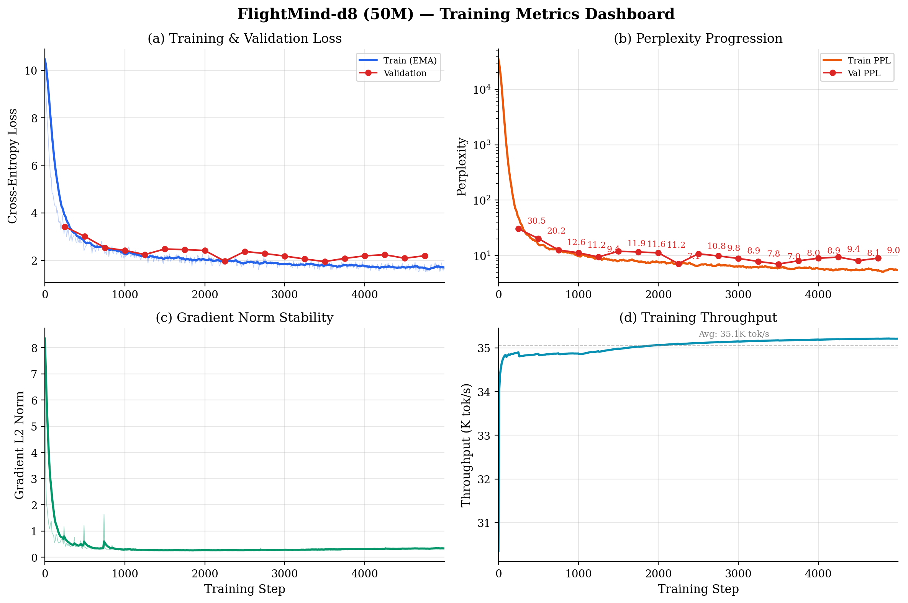
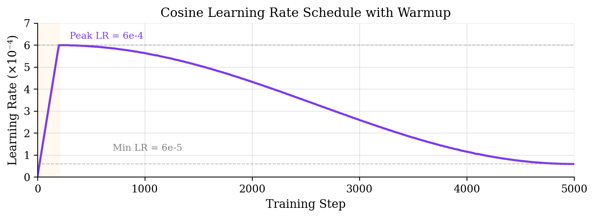
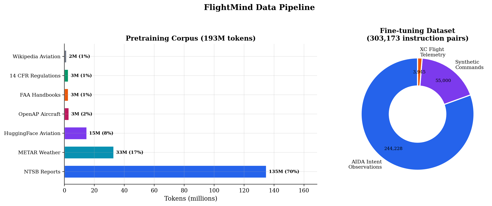

# FlightMind Training Pipeline

A detailed guide to how we train FlightMind from random weights to a functional language model. Every decision is explained — this document is meant to teach, not just document.



*Figure: FlightMind-d8 (50M params) training on RTX 4060 with 109M aviation tokens. (a) Loss converges from 10.45 to ~2.25 in 910 steps, with validation tracking closely. (b) Perplexity drops from ~35,000 to ~12.6. (c) Gradient norms stabilize below 0.5 after warmup. (d) Throughput steady at ~34.8K tok/s.*

## Table of Contents
1. [The Big Picture](#the-big-picture)
2. [Data Preparation](#data-preparation)
3. [The Training Loop](#the-training-loop)
4. [Optimizer: AdamW](#optimizer-adamw)
5. [Learning Rate Schedule](#learning-rate-schedule)
6. [Gradient Accumulation](#gradient-accumulation)
7. [Mixed Precision Training](#mixed-precision-training)
8. [Multi-GPU Training (DDP)](#multi-gpu-training-ddp)
9. [FineWeb-EDU Streaming](#fineweb-edu-streaming)
10. [Checkpointing & Resumption](#checkpointing--resumption)
11. [Evaluation](#evaluation)
12. [Scaling: From Smoke Test to Full Training](#scaling)
13. [Common Training Pathologies](#common-training-pathologies)
14. [Compute Budget](#compute-budget)

---

## The Big Picture

Training an LLM is conceptually simple: show the model a lot of text, and teach it to predict the next token. The model sees "The pilot checked the" and learns that "weather" or "instruments" are good next words, while "bicycle" is not.

Concretely, one training step looks like:

```
1. Sample a batch of token sequences from the training data
2. Feed them through the model to get predictions
3. Compare predictions to actual next tokens (cross-entropy loss)
4. Compute gradients (backpropagation)
5. Update model weights (optimizer step)
6. Repeat 50,000+ times
```

The art is in the details of each step.

---

## Data Preparation

### The Problem: Variable-Length Documents

Our training data is a collection of documents of wildly different lengths:
- METAR observations: ~30 tokens each
- FAA regulation sections: ~200-500 tokens
- NTSB accident reports: 500-5,000 tokens
- Wikipedia articles: 1,000-10,000+ tokens

But GPUs want **fixed-size tensors**. We can't feed in documents of different lengths without padding (wasteful) or bucketing (complex).

### The Solution: Document Packing

We concatenate all documents into one enormous stream, separated by `<|endoftext|>` tokens, then slice this stream into fixed-length sequences:

```
Doc A (50 tok) + EOT + Doc B (200 tok) + EOT + Doc C (30 tok) + EOT + ...
|---- sequence 1 (2048 tokens) ----||---- sequence 2 (2048 tokens) ----|...
```

This means:
- **Short docs share a sequence**: A 30-token METAR and a 200-token regulation might end up in the same 2048-token sequence. The model learns to handle document boundaries naturally.
- **Long docs span sequences**: A 5000-token NTSB report occupies ~2.5 sequences. The model sees the first half in one training example and the second half in another.
- **Zero waste**: No padding tokens. Every token in every batch is a real training signal.

This is exactly how GPT-2, LLaMA, and all modern LLMs handle pretraining data.

### Data Mixing

We have two pools:
- **Aviation data** (~108M tokens, stored locally): NTSB reports, FAA handbooks, METARs, regulations, Wikipedia aviation articles, HuggingFace aviation datasets, OpenAP aircraft data
- **General data** (~1.3T tokens, streamed): FineWeb-EDU educational web text from HuggingFace

We target a **70% general / 30% aviation mix**. Why not 100% aviation?

1. **Language foundation**: The model needs to learn English grammar, common phrases, and general world knowledge. A model trained only on METARs would struggle with natural language.
2. **Transfer learning**: General language ability transfers to aviation understanding. Knowing what "inspection" means in everyday English helps understand "preflight inspection."
3. **Diversity prevents overfitting**: Pure aviation data would cause the model to memorize patterns rather than learn language.

For d8 local training, the ratio was limited by available general data (only a 10K-doc FineWeb sample stored locally, giving ~89.5% aviation / 10.5% general). For d24+ cloud training, we stream FineWeb-EDU directly from HuggingFace, achieving the full 30/70 target ratio. See [FineWeb-EDU Streaming](#fineweb-edu-streaming) for details.

### Storage Format

Sequences are saved as raw binary files of `uint16` values (2 bytes per token, since our vocabulary is 32,768 < 65,536). This allows **memory mapping**: the OS loads only the sequences we need into RAM, rather than the entire file. With 100M tokens, the training data is ~200 MB — manageable, but memory mapping becomes essential at larger scales.

---

## The Training Loop

### Next-Token Prediction (Causal Language Modeling)

Given a sequence `[t₁, t₂, t₃, ..., tₙ]`, the model predicts:
- Position 1: predict t₂ from [t₁]
- Position 2: predict t₃ from [t₁, t₂]
- Position 3: predict t₄ from [t₁, t₂, t₃]
- ...and so on

Every position produces a probability distribution over the 32,768 vocabulary tokens. We compare this to the actual next token using **cross-entropy loss**:

```
loss = -log(P(correct_token))
```

If the model assigns probability 0.1 to the correct token: loss = -log(0.1) = 2.30
If the model assigns probability 0.9: loss = -log(0.9) = 0.105

The loss is averaged over all positions in all sequences in the batch. One training step processes `batch_size × sequence_length` predictions.

### Why `input = tokens[:-1]` and `target = tokens[1:]`?

Each sequence of 2048 tokens gives us 2047 predictions:
```
Input:  [t₁, t₂, t₃, ..., t₂₀₄₇]  (first 2047 tokens)
Target: [t₂, t₃, t₄, ..., t₂₀₄₈]  (last 2047 tokens, shifted by 1)
```

This is a natural consequence of next-token prediction: the input at position i should predict the token at position i+1.

---

## Optimizer: AdamW

### Why Not Plain SGD?

Stochastic Gradient Descent (SGD) uses a single learning rate for all parameters:
```
weight = weight - lr * gradient
```

This struggles with transformers because:
1. **Different parameters need different learning rates**: The embedding layer handles discrete tokens while attention layers process continuous features. A good LR for one is terrible for the other.
2. **Noisy gradients**: With large vocabularies, most tokens don't appear in a given batch, so gradient estimates are noisy. SGD reacts to this noise; Adam smooths it out.
3. **Loss landscape**: Transformers have a complex, non-convex loss landscape. Adam's adaptive learning rates navigate it better.

### How Adam Works

Adam maintains two exponential moving averages for each parameter:
- **m (momentum)**: Running average of gradients. Smooths out noise and provides direction.
- **v (variance)**: Running average of squared gradients. Estimates how much each parameter's gradient varies.

The update rule:
```
m = 0.9 * m + 0.1 * gradient          # Momentum (β₁ = 0.9)
v = 0.95 * v + 0.05 * gradient²       # Variance (β₂ = 0.95)
weight = weight - lr * m / (√v + ε)    # Adaptive update
```

This means:
- Parameters with consistently large gradients get effectively smaller updates (√v is large)
- Parameters with small, consistent gradients get effectively larger updates
- The optimizer automatically adapts the learning rate per-parameter

### Why β₂ = 0.95 Instead of 0.999?

The default Adam uses β₂ = 0.999, which averages over the last ~1000 steps. For LLM training, this is too slow — the loss landscape changes faster than the variance estimate can track. β₂ = 0.95 (averaging over ~20 steps) is more responsive and is now standard for LLM pretraining.

### What the "W" in AdamW Adds

Standard Adam applies weight decay inside the adaptive update:
```
gradient = gradient + wd * weight   # L2 regularization ON the gradient
weight -= lr * adapted(gradient)
```

AdamW decouples weight decay from the gradient:
```
weight -= lr * adapted(gradient)    # Normal Adam step
weight -= lr * wd * weight          # Separate decay step
```

This matters because Adam's adaptive scaling would reduce the effective weight decay for parameters with large gradients. Decoupling ensures consistent regularization regardless of gradient magnitude.

### Weight Decay Groups

We only apply weight decay to 2D parameters (weight matrices), not to 1D parameters (normalization scales). Why?

- **Weight matrices** benefit from regularization: it prevents any single weight from growing too large and dominating.
- **Norm parameters** (RMSNorm scale γ) should be free to take any value. They're one number per feature dimension and need to compensate for scale changes through the network. Regularizing them hurts training.

```python
decay_params = [p for p in model.parameters() if p.dim() >= 2]
nodecay_params = [p for p in model.parameters() if p.dim() < 2]
```

---

## Learning Rate Schedule



### Why Not a Constant Learning Rate?

A constant LR is a compromise: too high and training is unstable (loss spikes, divergence), too low and training is painfully slow. The solution is to vary the LR over time.

### Phase 1: Linear Warmup (Steps 0 → 500)

LR increases linearly from 0 to the peak (6e-4).

**Why warm up?** At initialization, the model's weights are random and the loss is very high. Large learning rates cause enormous gradient updates that can destabilize training permanently. By starting small and increasing gradually, we let the optimizer's momentum and variance estimates (m and v) stabilize before making large steps.

Empirically, 500-2000 warmup steps works well. Too few → instability. Too many → wasted compute at low LR.

### Phase 2: Cosine Decay (Steps 500 → 50,000)

LR follows a cosine curve from the peak (6e-4) down to a minimum (6e-5):

```
lr = min_lr + 0.5 * (max_lr - min_lr) * (1 + cos(π * progress))
```

**Why cosine?** Compared to alternatives:
- **Step decay** (halve LR at fixed intervals): Causes loss spikes at each step. The model abruptly goes from one regime to another.
- **Linear decay**: Works okay but empirically slightly worse than cosine.
- **Cosine**: Smooth decay that spends more time at moderate LRs (the most productive range). The gradual taper at the end allows fine-tuning without the LR disappearing.

**Why min_lr = max_lr / 10?** Setting min_lr = 0 means the model takes infinitesimally small steps in the final training phase, which can cause slight quality regression. A small floor keeps the model actively learning until the very end.

---

## Gradient Accumulation

### The Problem: GPU Memory

We want large batch sizes for training stability. The Chinchilla-optimal batch size is around 0.5-1M tokens per optimizer step. With a sequence length of 2048, that's ~250-500 sequences.

But our RTX 4060 (8GB VRAM) can only fit ~4-8 sequences at once for a d20 (566M) model. Each sequence requires:
- Forward pass activations: ~seq_len × n_layer × n_embd × 2 bytes ≈ 100 MB per sequence
- Gradients: same as parameters ≈ 1.1 GB
- Optimizer states (m, v): 2× parameters ≈ 2.2 GB

### The Solution: Simulate Large Batches

Instead of processing 256 sequences at once, process 4 sequences 64 times, accumulating gradients:

```python
optimizer.zero_grad()                    # Start fresh
for micro_step in range(64):             # 64 micro-batches
    x, y = get_batch(batch_size=4)       # 4 sequences each
    loss = model(x, y) / 64             # Scale by accumulation steps
    loss.backward()                      # Accumulate gradients
optimizer.step()                         # One update using all 256 sequences' gradients
```

The `/64` scaling ensures the accumulated gradients are averaged (not summed), making this mathematically equivalent to a single forward pass with batch_size=256.

**The only difference**: Batch normalization statistics would differ (we use RMSNorm, which is per-sample, so this doesn't apply). For our architecture, gradient accumulation is exactly equivalent to larger batches.

---

## Mixed Precision Training

### The Idea

Most of a model's computation happens in matrix multiplications. These don't need full float32 (32-bit) precision — float16 or bfloat16 (16-bit) is sufficient for the forward and backward passes.

### Why bfloat16 Specifically?

```
float32:  1 sign + 8 exponent + 23 mantissa  (full precision)
float16:  1 sign + 5 exponent + 10 mantissa  (limited range, okay precision)
bfloat16: 1 sign + 8 exponent +  7 mantissa  (full range, lower precision)
```

- **float16**: Can represent numbers up to ~65,504. This is a problem because loss values and gradient norms can exceed this range, causing overflow → NaN. Requires loss scaling to work around this.
- **bfloat16**: Same range as float32 (up to ~3.4 × 10³⁸) but lower precision. No loss scaling needed. Slightly less precise but much easier to use.

We use bfloat16 for forward/backward passes but keep the optimizer's master copy of weights in float32. This gives us:
- **2× throughput**: Half the memory per activation = twice the batch size or twice the speed
- **2× less memory**: Activations stored in 16-bit
- **Full precision updates**: The optimizer still makes float32-accurate weight updates

### The `autocast` Context Manager

```python
with torch.amp.autocast(device_type="cuda", dtype=torch.bfloat16):
    logits, loss = model(x, y)  # Everything inside runs in bfloat16
```

PyTorch automatically handles the float32 ↔ bfloat16 conversions. Certain operations that need float32 precision (like softmax, loss computation) are kept in float32 automatically.

---

## Multi-GPU Training (DDP)

### Why DDP?

When a model fits in one GPU's VRAM (d24 at ~15 GB, d32 at ~35 GB on 80 GB H100s), **DistributedDataParallel (DDP)** is the simplest and most efficient parallelism strategy. Each GPU holds a full copy of the model and processes different data. After each optimizer step, gradients are synchronized via all-reduce so all copies stay identical.

DDP gives near-linear scaling: 4 GPUs ≈ 4x throughput. This is because the only overhead is the gradient all-reduce, which overlaps with backward computation on modern NCCL implementations.

### How It Works in pretrain.py

The training script auto-detects whether it was launched via `torchrun` (which sets `RANK`, `LOCAL_RANK`, `WORLD_SIZE` environment variables) or plain `python`:

```bash
# Multi-GPU (DDP mode)
torchrun --nproc_per_node=4 train/pretrain.py --depth 24

# Single-GPU (backward compatible)
python train/pretrain.py --depth 24 --device cuda
```

In DDP mode:
1. **Each GPU gets a different random seed** (`seed + rank`) so they sample different batches
2. **The model is wrapped with `DDP(model, device_ids=[local_rank])`** after checkpoint loading
3. **Gradient accumulation uses `no_sync()`** to avoid redundant all-reduce calls during micro-steps
4. **Only rank 0** logs, evaluates, and saves checkpoints; other ranks wait at `dist.barrier()`

### The `no_sync()` Optimization

Without `no_sync()`, DDP triggers an all-reduce after every `loss.backward()` call. With 8 micro-steps of gradient accumulation, that's 8 all-reduce operations per optimizer step -- 7 of which are wasted since we only need the final accumulated gradient.

```python
for micro_step in range(grad_accum_steps):
    is_last = (micro_step == grad_accum_steps - 1)
    ctx = nullcontext() if is_last else model.no_sync()
    with ctx:
        logits, loss = model(x, y)
        (loss / grad_accum_steps).backward()
# All-reduce only happens on the last micro-step
```

This reduces inter-GPU communication by `grad_accum_steps` times (8x in our case).

### NCCL Pitfalls on Cloud GPUs

NCCL (NVIDIA Collective Communications Library) handles the GPU-to-GPU communication. On cloud providers like Vast.ai, the Docker container environment can block certain NCCL features:

- **NVLS (NVLink Sharp)**: A multicast optimization for NVLink. Not supported in most Docker containers. Causes DDP to hang silently at model initialization. Fix: `NCCL_NVLS_ENABLE=0`.
- **P2P and IB**: Usually work fine on NVLink-connected GPUs within a single node. Only disable if you see hangs after fixing NVLS.

Diagnosis: Run with `NCCL_DEBUG=INFO` and look for "Connected all trees" followed by a hang at NVLS buffer allocation.

---

## FineWeb-EDU Streaming

### The Problem: Data Repetition

Our local aviation corpus is 108M tokens. Training d24 for 95K steps at 524K tokens/step consumes ~50B token-presentations. Without additional data, the model would see each token ~460 times -- extreme overfitting.

### The Solution: Stream General Data from HuggingFace

Instead of downloading HuggingFace's FineWeb-EDU dataset (1.3T tokens, hundreds of GB), we stream it during training. The `FineWebStreamer` class in `dataloader.py`:

1. Opens a streaming connection to `HuggingFaceFW/fineweb-edu` on HuggingFace Hub
2. Fetches documents on-demand via HTTP (no full download)
3. Tokenizes each document with our BPE tokenizer
4. Packs tokens into 2048-length sequences (same format as local data)
5. Buffers 256 pre-packed sequences for smooth batch delivery

### Mixed Batching

Each micro-batch is split according to `--aviation-ratio` (default 0.30):

```
Micro-batch (8 sequences):
  [aviation_1] [aviation_2] [fineweb_1] [fineweb_2] [fineweb_3] [fineweb_4] [fineweb_5] [fineweb_6]
  |--- 30% local data ---|  |------------- 70% streamed from HuggingFace -------------|
```

The two halves are fetched independently and concatenated with `torch.cat()` before the forward pass. From the model's perspective, it's a single batch of 8 sequences -- it doesn't know or care which are aviation and which are general.

### DDP Sharding

In multi-GPU mode, each rank gets a different shard of the FineWeb stream (`ds.shard(num_shards=world_size, index=rank)`). This ensures no two GPUs process the same documents, even though the data is streamed rather than pre-split.

### Performance

FineWeb streaming adds ~5-10% overhead compared to pure local data (175K tok/s vs 185K tok/s on 4x H100), primarily from on-the-fly tokenization. The shuffle buffer (10K documents) takes ~15 seconds to initialize at the start of training. After that, the stream stays well ahead of GPU consumption since the network bandwidth (~500 Mbps) far exceeds the ~100 KB/s of raw text the training loop actually needs.

---

## Checkpointing & Resumption

### What We Save

A checkpoint contains:
1. **Model weights** (`model.state_dict()`): All learned parameters
2. **Optimizer state** (`optimizer.state_dict()`): The momentum (m) and variance (v) estimates for every parameter
3. **Config**: Model architecture parameters (depth, vocab_size, max_seq_len)
4. **Step number**: Where we are in training
5. **Loss**: Most recent loss value

### Why Save Optimizer State?

Adam's m and v estimates take hundreds of steps to warm up. If we resumed training with fresh optimizer state, the first few hundred steps would effectively be "re-warming up" — wasted compute and potential loss spikes. Saving and restoring optimizer state allows seamless resumption as if training never stopped.

### Checkpoint Strategy

- **`best.pt`**: Saved whenever validation loss improves. This is the checkpoint we'll use for deployment.
- **`step_N.pt`**: Saved every 1,000 steps. Insurance against crashes — we never lose more than 1,000 steps of work.
- **`final.pt`**: Saved at the end of training.

Each checkpoint for a d20 model is about 2.2 GB (566M params × 4 bytes/param for model + 2× for optimizer state).

---

## Evaluation

### Validation Perplexity

Every 500 steps, we compute the average loss on held-out validation data (1% of our corpus). This serves two purposes:

1. **Monitor overfitting**: If train loss keeps decreasing but val loss starts increasing, the model is memorizing training data instead of learning generalizable patterns.
2. **Model selection**: The checkpoint with the lowest validation loss is our best model — it generalizes best to unseen text.

We convert loss to perplexity for interpretability: `perplexity = exp(loss)`.

### Sample Generation

Numbers don't tell the whole story. We periodically generate text from aviation prompts to qualitatively assess the model's capabilities. A model with good perplexity but incoherent generations might be memorizing n-grams rather than learning structure.

The built-in prompts test:
- **Aviation knowledge**: "The Cessna 172 is powered by a..." (expects Lycoming O-320 or similar)
- **Procedures**: "On approach to landing..." (expects flap configuration, airspeed, etc.)
- **Weather**: "A METAR report showing TSRA indicates..." (expects thunderstorm with rain)
- **Regulations**: "A private pilot certificate requires..." (expects 40 hours minimum)

---

## Scaling: From Smoke Test to Full Training {#scaling}

### Smoke Test (CPU, d4, 20 steps)

Purpose: Verify the code works end-to-end. The model (d4 = ~8M params) is too small to learn anything meaningful, but we check that:
- Loss decreases (the model can learn)
- No crashes, NaNs, or shape mismatches
- Checkpointing saves and loads correctly

### Local GPU Training (RTX 4060, d8-d12)

Purpose: Validate training dynamics on a real model. With d8 (50M params) and 99M tokens, we can do a meaningful training run:
- ~2 epochs over the data
- Should see perplexity drop to ~50-100
- Takes 4-8 hours on a single RTX 4060

### Cloud GPU Training (Vast.ai, d24/d32)

With DDP and FineWeb-EDU streaming, we scale to production model sizes on rented cloud GPUs:

**d24 (956M params) on 4x H100 SXM:**
- 95K steps, 524K tokens/step = ~50B token-presentations
- 30% aviation (local, repeated ~140x) + 70% FineWeb-EDU (streamed, never repeated)
- Throughput: ~175K tok/s → ~3.0 sec/step → ~79 hours wall time
- Cost: ~$506 on Vast.ai at $6.40/hr (4x H100 SXM)
- This is near Chinchilla-optimal: 956M params × 20 = ~19B tokens recommended; we're training on ~50B effective tokens for thorough convergence

**d32 (2.2B params) on 4x H100 SXM:**
- Same 95K steps, 524K tokens/step, but batch_size=4 (higher VRAM per GPU)
- Estimated ~155 hours → ~$1,240
- Requires 80GB GPUs (35 GB model + optimizer)

The cloud training workflow is documented in [vastai_setup_guide.md](../docs/vastai_setup_guide.md) with step-by-step instructions, NCCL fixes, and monitoring commands.

---

## Common Training Pathologies

### Loss Spikes
**Symptom**: Loss suddenly jumps up by 2-10x, then (hopefully) recovers.
**Causes**: Learning rate too high, data corruption, numerical instability.
**Fix**: Gradient clipping (we use max_norm=1.0), lower LR, check data pipeline.

### Loss Plateau
**Symptom**: Loss stops decreasing for thousands of steps.
**Causes**: LR too low, model too small for the data, data quality issues.
**Fix**: Check LR schedule, try larger model, inspect training data.

### NaN Loss
**Symptom**: Loss becomes NaN and never recovers.
**Causes**: LR too high, missing gradient clipping, float16 overflow, data contains special values.
**Fix**: Use bfloat16 (larger range), add gradient clipping, check for infinities in data.

### Validation Loss Diverging from Train Loss
**Symptom**: Train loss keeps decreasing but val loss increases.
**Diagnosis**: Overfitting — the model is memorizing training data.
**Fix**: More data, add dropout, reduce model size, stop training earlier.

With only 99M tokens and a 566M parameter model, we expect to see some overfitting after 1-2 epochs. This is normal and expected — we're deliberately training a larger model than our data technically supports to maximize the model's capacity for aviation knowledge.

---

## Compute Budget

### FLOPs Estimation

For a transformer with P parameters and D tokens:
```
Total FLOPs ≈ 6 × P × D
```

(Factor of 6: ~2× for forward, ~4× for backward. The backward pass is roughly 2× the forward because we compute gradients for both weights and activations.)

### d8 (50M params, local)

- P = 50M, D = 25.6B token-presentations (5K steps × 512K tok/step × ~10 passes over data)
- Actually limited: 5K steps × 524K = 2.6B token-presentations
- Total FLOPs ≈ 6 × 50M × 2.6B ≈ 7.8 × 10¹⁷ ≈ 0.78 ExaFLOPs
- RTX 4060 at ~15 TFLOPS (bf16): ~14.5 hours theoretical, 10.3 hours actual (~71% utilization)

### d24 (956M params, cloud)

- P = 956M, D = 95K steps × 524K tok/step ≈ 49.8B token-presentations
- Total FLOPs ≈ 6 × 956M × 49.8B ≈ 2.85 × 10²⁰ ≈ 285 ExaFLOPs
- 4x H100 SXM at ~990 TFLOPS each: 285e18 / (4 × 990e12) / 3600 ≈ 20 hours theoretical
- Actual: ~79 hours (~25% utilization -- memory-bound for smaller batch sizes)
- Cost: ~$506 at $6.40/hr on Vast.ai

### d32 (2.2B params, planned)

- P = 2.21B, D = 95K steps × 524K tok/step ≈ 49.8B token-presentations
- Total FLOPs ≈ 6 × 2.21B × 49.8B ≈ 6.6 × 10²⁰ ≈ 660 ExaFLOPs
- 4x H100 SXM: ~155 hours, ~$1,240

### Cost Comparison

| Model | GPU Setup | Wall Time | Total Cost | $/B tokens |
|-------|-----------|-----------|------------|------------|
| d8 (50M) | 1x RTX 4060 | 10.3 hrs | ~$0 (local) | -- |
| d24 (956M) | 4x H100 SXM | ~79 hrs | ~$506 | ~$10.2 |
| d32 (2.2B) | 4x H100 SXM | ~155 hrs | ~$1,240 | ~$24.9 |

---

## Instruction Fine-Tuning with LoRA

After pretraining, we specialize FlightMind for AIDA's instruction-following tasks using **Low-Rank Adaptation (LoRA)** (Hu et al., 2021).

### Why LoRA Instead of Full Fine-Tuning?

Full fine-tuning updates all model parameters, which for a d24 model means 956M weights requiring ~12 GB of optimizer state. LoRA freezes the pretrained weights and injects small trainable matrices into each attention and MLP layer:

```
Original: Y = X @ W                      (W is frozen)
LoRA:     Y = X @ W + X @ A @ B          (A and B are trained)
```

Where `W` is the original `d × d` weight matrix, `A` is `d × r`, and `B` is `r × d`, with rank `r` typically 8-32. For r=16 on a d24 model, LoRA adds only ~10M trainable parameters (~1% of total), reducing VRAM requirements by ~10x.

### Chat Template and Loss Masking

Fine-tuning data uses a structured chat format:

```
<|system|>You are FlightMind, an aviation AI copilot for AIDA.<|end|>
<|user|>turn heading three six zero<|end|>
<|assistant|>{"action": "heading", "value": 360}
Roger, turning to heading 360.<|end|>
```

Critically, we only compute loss on the **assistant tokens**. The system prompt and user message are context — training on them would teach the model to generate user messages rather than respond to them. This is implemented via a binary loss mask.

### Merged Deployment

After fine-tuning, LoRA weights are **merged** into the base model: `W_new = W + A @ B`. The resulting model has identical architecture to the original — no LoRA overhead at inference time. This merged checkpoint is what gets deployed to AIDA.

### Fine-Tuning Data



Our fine-tuning dataset comprises 303,173 instruction-response pairs derived from three sources:

| Source | Examples | Description |
|--------|----------|-------------|
| AIDA intent observations | 244,228 | Real command/action pairs from 148K sim recordings |
| Synthetic commands | 55,000 | Template-expanded variations across 9 categories |
| XC flight telemetry | 3,945 | Status narrations and phase transitions from 40 flights |

---

## File Reference

| File | Purpose |
|------|---------|
| `train/pretrain.py` | Main pretraining loop with AdamW, cosine schedule, DDP |
| `train/finetune.py` | LoRA instruction fine-tuning with loss masking |
| `train/dataloader.py` | Tokenize JSONL → pack sequences → save binary; FineWeb-EDU streaming |
| `train/evaluate.py` | Perplexity measurement and sample generation |
| `data/tokenized/train.bin` | Packed training sequences (uint16 binary) |
| `data/tokenized/val.bin` | Packed validation sequences |
| `data/tokenized/meta.json` | Dataset statistics and configuration |
| `data/finetune/` | AIDA instruction fine-tuning data (JSONL + text) |
| `checkpoints/` | Model checkpoints (pretrained + fine-tuned) |
